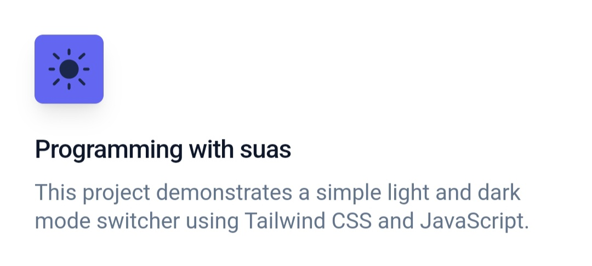
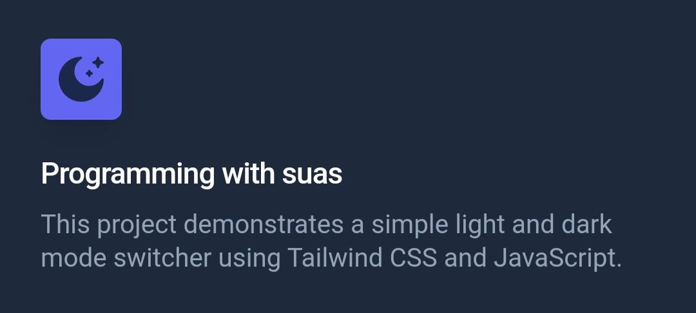

# Light and Dark Mode Switcher

This project demonstrates a simple light and dark mode switcher using Tailwind CSS and JavaScript.

## How to Switch Modes

To switch between light and dark modes, click on the respective icons:

- ☀️ Light Mode: Click on the sun icon.
- 🌙 Dark Mode: Click on the moon icon.

## Preview

### Light Mode



### Dark Mode



## Usage

1. Clone the repository:

   ```bash
   git clone https://github.com/sazzadulalambd/tailwind.git
   ```

2. Open the `index.html` file in your web browser.

3. Click on the sun icon to enable light mode and the moon icon for dark mode.

## Structure

- `index.html`: HTML file containing the structure of the webpage.
- `assets/`: Folder containing SVG icons and other assets.
- `css/`: Folder containing Tailwind CSS styles.
- `js/`: Folder containing the JavaScript file (`app.js`) for theme switching.

## Contributing

Feel free to contribute to this project by creating issues or submitting pull requests.

## License

This project is licensed under the MIT License - see the [LICENSE](LICENSE) file for details.
